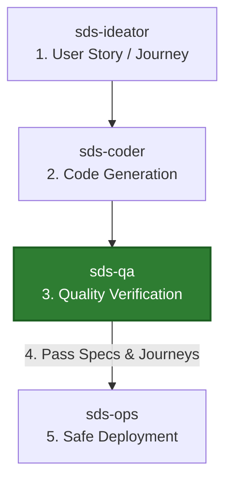

# sds-qa (Quality Assurance & Verification)

The **`sds-qa`** skill bridges the critical gap between coding (`sds-coder`) and production operations (`sds-ops`). It is the non-negotiable **quality gatekeeper** of the Spec-Defined Software (SDS) delivery pipeline.

> [!NOTE]
> **Ecosystem Status: 🔵 Planned / 模块开发状态：规划中**
> This module (`sds-qa`) is currently **Planned** as outlined in our [Roadmap](../index.md#ecosystem-roadmap). The specifications and instructions below describe the target design and behavioral interface, but the physical skill package is not yet active.
> 本模块目前处于**规划中**阶段。下述规范和指令描述了其目标架构和行为定义，但其实体技能包尚未正式激活。



---

## 🎯 Core Objectives

1. **User Story & Journey Closure (Requirements Closure)**: Validating that multiple capabilities connect flawlessly to satisfy the holistic business workflows mapped in the project's `user-journey.md` files.
2. **AC-to-Test Synthesis**: Translating isolated Acceptance Criteria (AC) from `spec.md` into standard, executable unit and integration test assertions.
3. **Boundary & Adversarial Testing**: Generating adversarial inputs to verify system robustness under pressure.
4. **Gatekeeping Sign-off**: Restricting deployments until 100% of the User Stories are verified and zero-drift compliance is certified by `sds-core`.

---

## 🔄 The Closed-Loop Verification Philosophy

Verifying individual specifications (such as a single API endpoint's response) only guarantees *local correctness*. A system with perfectly passing local specs can still fail if the integration of those features does not support the actual end-user goals.

True **Requirements Closure** demands that our automated tests trace back to the macro-level **User Stories**:

```text
[ user-journey.md (User Story) ]
       │ (Chains multiple capabilities together)
       ├──► Capability 1 (user_auth.login)  ──► Tested & Passed ✓
       ├──► Capability 2 (cart.add_item)    ──► Tested & Passed ✓
       └──► Capability 3 (checkout.pay)     ──► Tested & Passed ✓
       │
       ▼ (E2E Integration Flow Verified)
[ Requirements Closure Certified! ]
```

---

## 🚀 The Quality Workflow

The `sds-qa` agent operates under a three-phase verification cycle:

### Phase 1: Test-Case Mapping (Specs & Journeys)
The agent first reads accepted `spec.md`, all AC derivation records and the source `user-journey.md` context, without reading implementation. It challenges each interpretation with a counterexample and derives expected results independently. Only then does it inspect code and map the tests to implementation:
* **Micro-Verification**: Maps each AC (Acceptance Criteria) to explicit unit assertions.
* **Macro-Verification**: Chains multiple APIs/views together in sequence, creating BDD (Behavior-Driven Development) integration tests that mimic the user path documented in the `user-journey.md`.

### Phase 2: Sandbox Execution & Audit
The agent boots an ephemeral, sandboxed test database/environment. It runs both the unit assertions and the E2E user-journey flows, monitoring coverage and database transition states.

### Phase 3: Release Handshake
Once 100% of the individual ACs **AND** the overarching User Journeys are verified as passing, `sds-qa` signs off on the release, generating a compliance certificate that unlocks the deployment phase (`sds-ops`).

The shipped `sds check` validates derivation record structure and trace identifiers; it does not automate this planned semantic QA process or certify business correctness.
