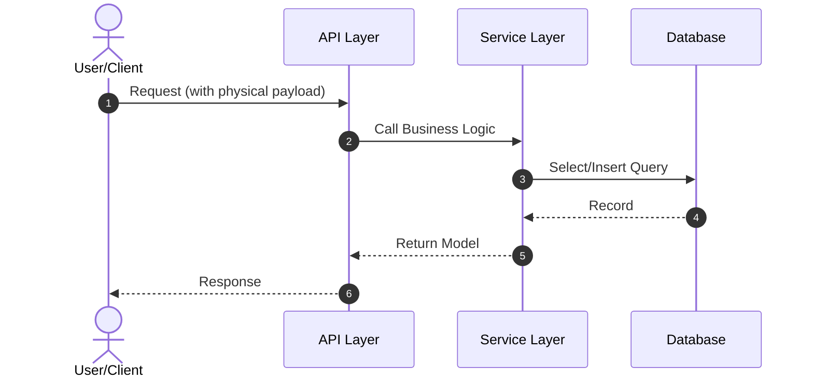

# Specification & Design Blueprints

Start with the packaged templates below. `sds init` generates the same authoring
structure. Replace every placeholder with accepted scenario conclusions before
implementation; a newly scaffolded draft is not ready to pass validation.

## Business specification

State the actor, initial state, goal and observable business outcomes. For every
AC, supply `ac_derivation` with a durable context source, reasoning, ambiguity
disposition and positive/counterexample expectations. No AC is exempt.

```markdown
---
capability_id: <module>.<capability_name>
status: defined  # options: defined, implemented, deprecated
version: 1.0.0
ac_derivation:
  AC-1:
    scenario: ../_context/user-journey.md
    reasoning: "<Explain why this outcome follows from the actor, initial state and goal>"
    ambiguity: "<Record the chosen interpretation and rejected alternative, or none>"
    validation: "<State a positive outcome and a boundary or counterexample outcome>"
  AC-2:
    scenario: ../_context/user-journey.md
    reasoning: "<Explain why this outcome follows from the actor, initial state and goal>"
    ambiguity: "<Record the chosen interpretation and rejected alternative, or none>"
    validation: "<State a positive outcome and a boundary or counterexample outcome>"
  AC-3:
    scenario: ../_context/user-journey.md
    reasoning: "<Explain why this outcome follows from the actor, initial state and goal>"
    ambiguity: "<Record the chosen interpretation and rejected alternative, or none>"
    validation: "<State a positive outcome and a boundary or counterexample outcome>"
---

# Capability Specification: <Capability Name>

## 1. Purpose
Identify the actor, initial business state, goal and observable outcome from accepted `_context/`. A concise statement of the business goal. Explain what problem this capability solves for the user, and why it is necessary.

## 2. Acceptance Criteria
Provide a list of verifiable conditions. Keep them clear, atomic, and testable using plain business/domain terms:

- **AC-1**: Given [Precondition] / When [Action] / Then [Expected business outcome]
- **AC-2**: Given [Precondition] / When [Action] / Then [Expected business outcome]
- **AC-3**: Given [Precondition] / When [Action] / Then [Expected business outcome]

## 3. Interface / Contract
Define the conceptual information exchange required for this capability. Do not include physical API routes, JSON payloads, or specific database/code schemas.

### A. Business Inputs (Information required to initiate):
- **User Identifier**: The identity of the authenticated user performing the action.
- **Input Item 1**: Explanation of the required business input (e.g. quantity, selected ID).

### B. Business Outputs (Information returned upon completion):
- **Result Status**: Succession or failure of the action from a business perspective.
- **Output Item 1**: Explanation of the business output (e.g. generated order reference).

## 4. Business Rules & Edge Cases
Detailed business constraints, validation rules, and specific edge case behaviors from the user's perspective:

- **Validation Rules**: Minimum lengths, business constraints, valid formats.
- **Error Behavior**: Map specific failure scenarios to user-friendly business descriptions.
- **Rate Limits & Boundaries**: Max/min thresholds, business throttling policies.

## 5. Operational Contract (When Applicable)
Define business-level lifecycle operational goals (e.g., retention, compliance, auditing rules). Keep technical choices (e.g. database schema migrations, deployment scripts, cron setups) in `design.md`.

## Authoring check
For every AC, complete `ac_derivation` above using business language and an
existing durable context path (optionally a heading anchor). Compare plausible
interpretations against the scenario. If the context cannot choose between
materially different outcomes, ask the user and block the dependent work.
Do not fill accepted reasoning from the current code or leave placeholder text.

Example business AC: Given an unpaid order / When the buyer cancels / Then the
order is cancelled and no payment is collected. Locking, transaction boundaries,
endpoint names, JSON keys and table columns belong in `design.md`. User-visible
compatibility or performance promises remain business requirements when needed.
Never reference temporary review artifacts; promote accepted conclusions here.
```

## Technical design

Translate each accepted business condition into a technical mechanism and map
all ACs to positive and boundary tests. Physical schemas, API fields and retry
algorithms belong here. Do not introduce new business policy through design.

---
sds_kind: authoritative-design
capability_id: <module>.<capability_name>
status: accepted
version: 1.0.0
---

# Technical Design Specification: <Capability Name>

## 1. Architectural & Protocol Overview
A high-level technical overview of how this capability will be integrated into the existing system architecture. State the chosen protocols (e.g., REST, gRPC, MQ), gateways, and component topology.

## 2. Business Contract Mapping
Bridge the gaps between the conceptual "Business Information Exchange" in `spec.md` and the physical API schema.

| Spec Information Element | Physical Field Name | Physical Type | Location (Header/Body/Query) | Constraints / Format |
| :--- | :--- | :--- | :--- | :--- |
| **User Identifier** | `userId` | `string` | Header / JWT payload | UUID format |
| **Input Item 1** | `quantity` | `integer` | Body JSON | `>= 1` |
| **Result Status** | `status` | `string` | Body Response JSON | Enum: `SUCCESS`, `FAILED` |
| **Output Item 1** | `orderId` | `string` | Body Response JSON | UUID format |

## 3. Sequence Diagram & Key Workflows
Outline how different components, services, or layers interact to achieve the user flows defined in the capability spec. Use Mermaid syntax for visualization:



## 4. Database Schema & Data Models
Details of new database schemas, migrations, or data modeling adjustments. Outline physical table names, primary keys, indexes, and constraints:

- **New Table/Modifications**: `table_name`
  - `id` (VARCHAR(64), Primary Key)
  - `field_name` (VARCHAR(128), Indexed)

## 5. Detailed API, Routing & Class Design (How)
Detailed classes, functions, controllers, or endpoint routing patterns. Include design patterns, cache strategies, or third-party SDK integration details.

## 6. Non-Functional Requirements & Performance Budgets
- **Response Budget**: e.g., HTTP requests must return in <200ms.
- **Cache Strategy**: e.g., Redis caching with TTL of 5 minutes.
- **Error Handling & Retry Mechanism**: e.g., Backoff retries on transient external API failures.

## 7. Local Code Layout & Source Directories (When Applicable)
- **Source Code Locations**: Paths to the primary editable source code files and directories.
- **Build/Compile Output (If applicable)**: Frontend build directories or local static bundle destinations.
- **Legacy Files & Entrypoints to Retire**: Code files, functions, or modules to delete/retire after implementing this design.

## 8. Local Data Migrations & Schema Evolution (When Applicable)
- **Migration Identity & Sequencing**: Migration/version identifier (e.g. Flyway file or local script timestamp) and its order.
- **Schema Backward/Forward Compatibility**: How the database schema change handles old/new data concurrently without breaking local runtime.
- **Local Rollback Script DDL**: SQL statements or commands to revert the database schema change locally in case of validation failures.

## 9. State Machine & Materialization (When Applicable)
- **Reachability**: Initial/empty, active, terminal, retry, and recovery transitions without circular prerequisites.
- **Truth & Writers**: Authoritative runtime store and single-writer boundaries.
- **Derived Outputs**: Materialization order, rebuildable projections/exports, and compatibility consumers.
- **Completion**: Scheduler ownership, missed-run detection, idempotent retry, backfill, and reconciliation.

## 10. AC Implementation & Verification Mapping
Use one row for EVERY AC. Derive positive and counterexample expectations from
context and spec before reading implementation. Do not change business outcomes
to fit a convenient mechanism; resolve conflicts in accepted context/spec first.

| AC | Technical mechanism | Positive test | Counterexample / boundary test |
| --- | --- | --- | --- |
| AC-1 | <Component and algorithm> | <Test and expected business outcome> | <Test disproving the rejected interpretation> |

Example: implement unpaid-order cancellation using an atomic state transition
that fails if payment has already completed. Test both cancellation before
payment and a payment/cancellation race against the accepted business outcome.
Omit inapplicable technical sections with a reason; do not invent APIs or tables.

## Validation and upgrades

New projects explicitly set `enforce_ac_derivation: true`; older projects missing the key retain previous checks with one migration warning. Existing projects need to add records
for every AC. An explicit false can temporarily ease migration, but the checker
reports that derivation was skipped. Structural coverage does not prove semantic
correctness: review each interpretation against its source scenario independently
of code. Durable documents must not depend on temporary review artifacts through
links, reference definitions, HTML, naked paths or escaped/encoded paths.
