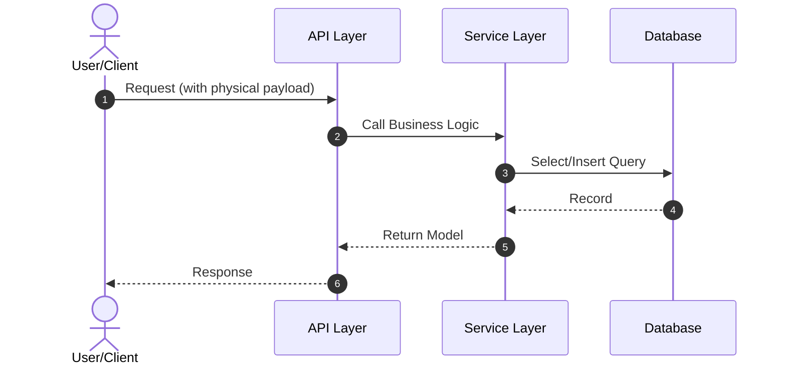

# Technical Design Specification: <Capability Name>

## 1. Architectural & Protocol Overview
A high-level technical overview of how this capability will be integrated into the existing system architecture. State the chosen protocols (e.g., REST, gRPC, MQ), gateways, and component topology.

## 2. Business Contract Mapping
Bridge the gaps between the conceptual "Business Information Exchange" in `spec.md` and the physical API schema.

| Spec Information Element | Physical Field Name | Physical Type | Location (Header/Body/Query) | Constraints / Format |
| :--- | :--- | :--- | :--- | :--- |
| **User Identifier** | `userId` | `string` | Header / JWT payload | UUID format |
| **Input Item 1** | `quantity` | `integer` | Body JSON | `>= 1` |
| **Result Status** | `status` | `string` | Body Response JSON | Enum: `SUCCESS`, `FAILED` |
| **Output Item 1** | `orderId` | `string` | Body Response JSON | UUID format |

## 3. Sequence Diagram & Key Workflows
Outline how different components, services, or layers interact to achieve the user flows defined in the capability spec. Use Mermaid syntax for visualization:

## 4. Database Schema & Data Models
Details of new database schemas, migrations, or data modeling adjustments. Outline physical table names, primary keys, indexes, and constraints:

- **New Table/Modifications**: `table_name`
  - `id` (VARCHAR(64), Primary Key)
  - `field_name` (VARCHAR(128), Indexed)

## 5. Detailed API, Routing & Class Design (How)
Detailed classes, functions, controllers, or endpoint routing patterns. Include design patterns, cache strategies, or third-party SDK integration details.

## 6. Non-Functional Requirements & Performance Budgets
- **Response Budget**: e.g., HTTP requests must return in <200ms.
- **Cache Strategy**: e.g., Redis caching with TTL of 5 minutes.
- **Error Handling & Retry Mechanism**: e.g., Backoff retries on transient external API failures.

## 7. Local Code Layout & Source Directories (When Applicable)
- **Source Code Locations**: Paths to the primary editable source code files and directories.
- **Build/Compile Output (If applicable)**: Frontend build directories or local static bundle destinations.
- **Legacy Files & Entrypoints to Retire**: Code files, functions, or modules to delete/retire after implementing this design.

## 8. Local Data Migrations & Schema Evolution (When Applicable)
- **Migration Identity & Sequencing**: Migration/version identifier (e.g. Flyway file or local script timestamp) and its order.
- **Schema Backward/Forward Compatibility**: How the database schema change handles old/new data concurrently without breaking local runtime.
- **Local Rollback Script DDL**: SQL statements or commands to revert the database schema change locally in case of validation failures.

## 9. State Machine & Materialization (When Applicable)
- **Reachability**: Initial/empty, active, terminal, retry, and recovery transitions without circular prerequisites.
- **Truth & Writers**: Authoritative runtime store and single-writer boundaries.
- **Derived Outputs**: Materialization order, rebuildable projections/exports, and compatibility consumers.
- **Completion**: Scheduler ownership, missed-run detection, idempotent retry, backfill, and reconciliation.
