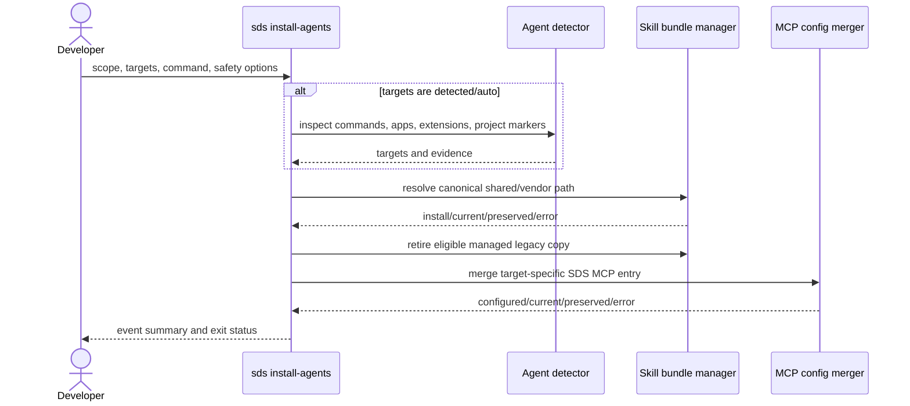

# Technical Design Specification: Install Agent Integrations

## 1. Architectural & Protocol Overview

`sds install-agents` resolves target metadata, optionally detects active agent
hosts, installs the packaged Skill bundle, and merges stdio MCP registrations.
Target metadata maps each user and project scope to either `.agents/skills` or
an agent-specific directory. It also declares detection commands, application
paths, extension globs, and project-use markers that SDS itself does not create.
Paths that became obsolete are retained as cleanup metadata for safe upgrades.

## 2. Business Contract Mapping

| Spec Information Element | Physical Representation | Type | Location | Constraint |
| :--- | :--- | :--- | :--- | :--- |
| Installation scope | `scope` | string | CLI option | `user` or `project` |
| Selected agents | `targets` | list/string | CLI option | Canonical target names or aliases |
| Target selection mode | `--targets` | string | CLI option | `detected` by default; `auto`, `all`, or explicit names remain available |
| SDS command | `command` | string | MCP entry | Executable plus `mcp` argument |
| Integration events | `InstallSummary.events` | list | Process output | One status per attempted action |
| Completion status | `InstallSummary.ok` | boolean | Process exit status | False when any event is an error |
| Bundle identity | `.sds-managed.json` | object | Installed Skill directory | `bundle_version` plus `bundle_hash` |
| Connection ownership outcome | `InstallEvent` | status/message | Process output | Canonical legacy SDS entries may advance; customized entries remain preserved |

### Target compatibility matrix

| Target | User Skill root | Project Skill root | MCP configuration |
| :--- | :--- | :--- | :--- |
| Shared | `.agents/skills` | `.agents/skills` | None |
| Codex | `.agents/skills` | `.agents/skills` | `.codex/config.toml` |
| OpenCode | `.agents/skills` | `.agents/skills` | `.config/opencode/opencode.json` / `opencode.json` |
| Claude Code | `.claude/skills` | `.claude/skills` | `.claude.json` / `.mcp.json` |
| Cursor | `.agents/skills` | `.agents/skills` | `.cursor/mcp.json` |
| Cline | `.cline/skills` | `.cline/skills` | None |
| Antigravity | `.gemini/config/skills` | `.agents/skills` | `.gemini/config/mcp_config.json` / `.agents/mcp_config.json` |
| Gemini CLI | `.agents/skills` | `.agents/skills` | `.gemini/settings.json` |
| GitHub Copilot | `.agents/skills` | `.agents/skills` | None |
| Windsurf | `.agents/skills` | `.agents/skills` | `.codeium/windsurf/mcp_config.json` / `.windsurf/mcp_config.json` |
| Roo Code | `.agents/skills` | `.agents/skills` | None |
| Kilo Code | `.agents/skills` | `.agents/skills` | None |

## 3. Sequence Diagram & Key Workflows

## 4. Database Schema & Data Models

No database is used. `AgentTarget` is immutable in-process metadata;
`InstallEvent` and `InstallSummary` are in-memory result records.

## 5. Detailed API, Routing & Class Design (How)

- `TARGETS` declares active user/project Skill roots, retired roots, MCP paths,
  MCP serialization styles, and conservative detection hints.
- `detect_agent_targets` checks executable discovery first, then known
  application paths, installed-extension globs, and project markers that are
  not written by this installer. It returns both targets and diagnostic
  evidence.
- CLI, installer API, and target resolver default to `detected`; null or empty
  selections also request detection. Bootstrap scripts inherit this default.
- `detected` and `auto` are equivalent selection modes. With no detected target,
  selection falls back to the `shared` target only. `all` retains its explicit
  all-target meaning.
- `install_agent_integrations` deduplicates resolved Skill paths, but continues
  to process MCP configuration for every selected target when opted in.
- `_retire_managed_bundle` removes only a directory with a valid SDS marker and
  an unchanged recorded bundle hash, unless `force` explicitly permits removal
  of a modified managed copy.
- `_install_json_mcp` interprets blank content as an empty object; JSON decoding
  errors from non-blank content remain failures with no write.
- `_install_json_mcp` recognizes only the exact SDS-only JSON shapes emitted by
  earlier releases: a standard server with an `sds` executable and `mcp`
  argument, or the equivalent OpenCode local command. These entries may advance
  to the requested executable path. Extra behavior, unknown executables, and
  unexpected fields remain user-owned unless `force` is selected.
- `.sds-managed.json` records the package-derived `bundle_version` and the
  SHA-256 `bundle_hash`. A legacy marker with current content is upgraded without
  replacing the bundle; a content change uses the existing atomic replacement.
- `sds version` reports CLI package, validation harness, and Skill bundle
  versions as distinct values.
- The package release is sourced dynamically from `sds.__version__`; a durable
  test requires `SKILL.md` metadata to declare that same release.
- Skill bundle replacement and text configuration writes remain atomic.

## 6. Non-Functional Requirements & Performance Budgets

- Installation time is linear in the number of selected targets and bundle files.
- No network access or third-party Python package is required.
- Detection performs bounded local filesystem and executable lookups only.
- Dry-run performs no writes or removals.
- A failure at one target is reported without concealing outcomes for the rest.

## 7. Local Code Layout & Source Directories

- Implementation: `skills/sds-core/src/sds/agent_install.py`
- CLI routing: `skills/sds-core/src/sds/cli.py`
- Durable tests: `skills/sds-core/tests/test_agent_install.py`
- User documentation: `README.md`, `docs/index.md`, `docs/index.zh.md`, and
  `docs/cli/installation.md`
- Legacy entrypoints to retire: none.

## 8. Local Data Migrations & Schema Evolution

There is no database migration. The filesystem migration is performed during a
normal install: after the current shared bundle is available, eligible
SDS-managed copies in retired agent-specific roots are removed. Preserved copies
remain visible in the event summary for manual review. Existing management
markers without `bundle_version` are upgraded in place when their content hash
already matches the packaged bundle.
Windsurf's earlier dedicated Skill roots are retired after its shared bundle is
current. Cline's `.cline/skills` root remains active because Cline does not
discover the shared root.

## 9. State Machine & Materialization

For each canonical Skill path, the states are absent, current, replaceable
managed, locally modified managed, user-owned, and invalid. Installation reaches
current before cleanup is attempted. The packaged Skill bundle is the source of
truth; installed directories are rebuildable materializations. Automatic target
selection has detected and shared-only fallback states; explicit target modes do
not depend on detection.

## 10. Optional MCP and OpenCode Compatibility

`configure_mcp=False` is the API default. CLI mutually exclusive `--with-mcp`
and legacy `--no-mcp` select this value; bootstrap scripts inherit the default.
`--opencode-config-version v1|v2` defaults to `v1`. OpenCode v1 stores local
servers at `mcp.sds`; v2 stores them at `mcp.servers.sds`. Both use
`type: local` and a command array. No version probing starts the client.
Before writing, the merger validates layout compatibility. It migrates only
canonical SDS entries (or an exact requested entry) from the other layout,
removing an empty obsolete container. Foreign mixed layouts, custom legacy
entries, and duplicate SDS entries fail without changing the config, even with
force. Dry-run performs the same validation and previews migration.

Official references: [v1 MCP configuration](https://opencode.ai/docs/fr/mcp-servers/)
and [v2 MCP configuration](https://opencode.ai/v2/docs/mcp-servers).

## 11. Acceptance Criteria Implementation and Verification Mapping

| AC | Technical mechanism | Positive business verification | Counterexample or boundary verification |
| :--- | :--- | :--- | :--- |
| AC-1 | Resolve and deduplicate canonical shared skill paths before copying. | Multiple compatible hosts discover one current bundle. | Hosts requiring dedicated discovery are not left with only a shared copy. |
| AC-2 | Target metadata routes unsupported shared-discovery scopes to vendor roots. | A dedicated host receives its discoverable skill. | Compatible shared hosts receive no redundant vendor copy. |
| AC-3 | Parse whitespace-only content as an empty object; reject malformed non-empty JSON before atomic write. | Empty placeholders initialize with the requested connection. | Malformed content remains byte-identical and produces an error. |
| AC-4 | Compare managed markers and bundle hashes before retiring obsolete roots. | Unmodified managed duplicates are removed after the current bundle is available. | Unmanaged or edited copies remain unless explicitly eligible for forced removal. |
| AC-5 | Default CLI/API/resolver to detected; explicit target lists bypass detection. | Detected hosts receive skills; selected subsets and all-target mode remain available. | No evidence selects only shared; unrelated host files remain untouched. |
| AC-6 | Record package-derived bundle version plus exact content hash in the managed marker. | Current content retains one bundle with separately reported release identities. | Changed content updates even when a semantic label alone would suggest no change. |
| AC-7 | Match only canonical legacy SDS invocation shapes before advancing executable paths. | Canonical SDS connections advance during an opted-in upgrade. | Extra arguments, environment settings, and unknown commands remain user-owned. |
| AC-8 | Default API and parser configuration to false; mutually exclusive MCP flags control configuration writes. | Normal install and upgrade install skills while all MCP bytes remain unchanged. | Explicit MCP opt-in adds selected connections; contradictory flags are rejected. |
| AC-9 | Select direct v1 or nested v2 server maps; validate and migrate recognizable legacy SDS entries before one atomic write. | Each supported generation receives its own layout; a standard misplaced SDS entry migrates idempotently. | Mixed non-SDS layouts, customized legacy entries, duplicate SDS entries, and incompatible timeout settings remain untouched with an error; dry-run never writes. |
