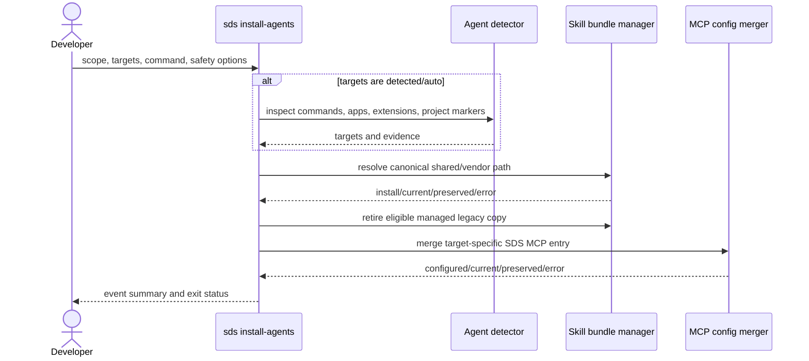

# Technical Design Specification: Install Agent Integrations

## 1. Architectural & Protocol Overview

`sds install-agents` resolves target metadata, optionally detects active agent
hosts, installs the packaged Skill bundle, and merges stdio MCP registrations.
Target metadata maps each user and project scope to either `.agents/skills` or
an agent-specific directory. It also declares detection commands, application
paths, extension globs, and project-use markers that SDS itself does not create.
Paths that became obsolete are retained as cleanup metadata for safe upgrades.

## 2. Business Contract Mapping

| Spec Information Element | Physical Representation | Type | Location | Constraint |
| :--- | :--- | :--- | :--- | :--- |
| Installation scope | `scope` | string | CLI option | `user` or `project` |
| Selected agents | `targets` | list/string | CLI option | Canonical target names or aliases |
| Target selection mode | `--targets` | string | CLI option | `detected` by default; `all` or explicit names remain available |
| SDS command | `command` | string | MCP entry | Executable plus `mcp` argument |
| Integration events | `InstallSummary.events` | list | Process output | One status per attempted action |
| Completion status | `InstallSummary.ok` | boolean | Process exit status | False when any event is an error |
| Bundle identity | `.sds-managed.json` | object | Installed Skill directory | `bundle_version` plus `bundle_hash` |
| Connection ownership outcome | `InstallEvent` | status/message | Process output | Canonical legacy SDS entries may advance; customized entries remain preserved |

### Target compatibility matrix

| Target | User Skill root | Project Skill root | MCP configuration |
| :--- | :--- | :--- | :--- |
| Shared | `.agents/skills` | `.agents/skills` | None |
| Codex | `.agents/skills` | `.agents/skills` | `.codex/config.toml` |
| OpenCode | `.agents/skills` | `.agents/skills` | `.config/opencode/opencode.json` / `opencode.json` |
| Claude Code | `.claude/skills` | `.claude/skills` | `.claude.json` / `.mcp.json` |
| Cursor | `.agents/skills` | `.agents/skills` | `.cursor/mcp.json` |
| Cline | `.cline/skills` | `.cline/skills` | None |
| Antigravity | `.gemini/config/skills` | `.agents/skills` | `.gemini/config/mcp_config.json` / `.agents/mcp_config.json` |
| Gemini CLI | `.agents/skills` | `.agents/skills` | `.gemini/settings.json` |
| GitHub Copilot | `.agents/skills` | `.agents/skills` | None |
| Windsurf | `.agents/skills` | `.agents/skills` | `.codeium/windsurf/mcp_config.json` / `.windsurf/mcp_config.json` |
| Roo Code | `.agents/skills` | `.agents/skills` | None |
| Kilo Code | `.agents/skills` | `.agents/skills` | None |

## 3. Sequence Diagram & Key Workflows

## 4. Database Schema & Data Models

No database is used. `AgentTarget` is immutable in-process metadata;
`InstallEvent` and `InstallSummary` are in-memory result records.

## 5. Detailed API, Routing & Class Design (How)

- `TARGETS` declares active user/project Skill roots, retired roots, MCP paths,
  MCP serialization styles, and conservative detection hints.
- `detect_agent_targets` checks executable discovery first, then known
  application paths, installed-extension globs, and project markers that are
  not written by this installer. It returns both targets and diagnostic
  evidence.
- `detected` and `auto` are equivalent selection modes. With no detected target,
  selection falls back to the `shared` target only. `all` retains its explicit
  all-target meaning.
- `install_agent_integrations` deduplicates resolved Skill paths, but continues
  to process MCP configuration for every selected target.
- `_retire_managed_bundle` removes only a directory with a valid SDS marker and
  an unchanged recorded bundle hash, unless `force` explicitly permits removal
  of a modified managed copy.
- `_install_json_mcp` interprets blank content as an empty object; JSON decoding
  errors from non-blank content remain failures with no write.
- `_install_json_mcp` recognizes only the exact SDS-only JSON shapes emitted by
  earlier releases: a standard server with an `sds` executable and `mcp`
  argument, or the equivalent OpenCode local command. These entries may advance
  to the requested executable path. Extra behavior, unknown executables, and
  unexpected fields remain user-owned unless `force` is selected.
- `.sds-managed.json` records the package-derived `bundle_version` and the
  SHA-256 `bundle_hash`. A legacy marker with current content is upgraded without
  replacing the bundle; a content change uses the existing atomic replacement.
- `sds version` reports CLI package, validation harness, and Skill bundle
  versions as distinct values.
- The package release is sourced dynamically from `sds.__version__`; a durable
  test requires `SKILL.md` metadata to declare that same release.
- Skill bundle replacement and text configuration writes remain atomic.

## 6. Non-Functional Requirements & Performance Budgets

- Installation time is linear in the number of selected targets and bundle files.
- No network access or third-party Python package is required.
- Detection performs bounded local filesystem and executable lookups only.
- Dry-run performs no writes or removals.
- A failure at one target is reported without concealing outcomes for the rest.

## 7. Local Code Layout & Source Directories

- Implementation: `skills/sds-core/src/sds/agent_install.py`
- CLI routing: `skills/sds-core/src/sds/cli.py`
- Durable tests: `skills/sds-core/tests/test_agent_install.py`
- User documentation: `README.md`, `docs/index.md`, `docs/index.zh.md`, and
  `docs/cli/installation.md`
- Legacy entrypoints to retire: none.

## 8. Local Data Migrations & Schema Evolution

There is no database migration. The filesystem migration is performed during a
normal install: after the current shared bundle is available, eligible
SDS-managed copies in retired agent-specific roots are removed. Preserved copies
remain visible in the event summary for manual review. Existing management
markers without `bundle_version` are upgraded in place when their content hash
already matches the packaged bundle.
Windsurf's earlier dedicated Skill roots are retired after its shared bundle is
current. Cline's `.cline/skills` root remains active because Cline does not
discover the shared root.

## 9. State Machine & Materialization

For each canonical Skill path, the states are absent, current, replaceable
managed, locally modified managed, user-owned, and invalid. Installation reaches
current before cleanup is attempted. The packaged Skill bundle is the source of
truth; installed directories are rebuildable materializations. Automatic target
selection has detected and shared-only fallback states; explicit target modes do
not depend on detection.
